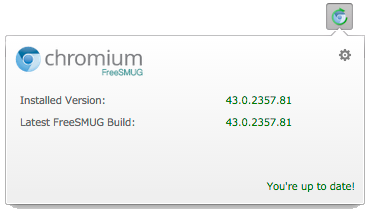
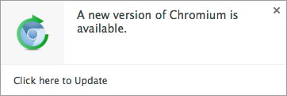

FreeSmug Updater for Chromium (macOS) Extension
==========================
Chromium Extension to check for, download and install the latest Chromium revisions from [FreeSMUG.org](http://www.freesmug.org/chromium)

macOS only

--
~~Safest to install from the [Chrome WebStore](https://chrome.google.com/webstore/detail/chromium-updater/ccgjmadhdidfloacagcnnodbkedkjedg)~~ _(WebStore no more availble)_.

For manual install, go to `chrome://extensions`, turn on Developer Mode at the top, click 'Load unpacked extension' and load the folder contents. Auto Updates won't work when installed this way.

  

--

I am not affiliated, associated, authorized, endorsed by, or in any way officially connected with Google Inc and the Chromium Brand or any of its subsidiaries or its affiliates.
The name "Chromium” as well as related names, marks, emblems and images are registered trademarks of Google Inc.
